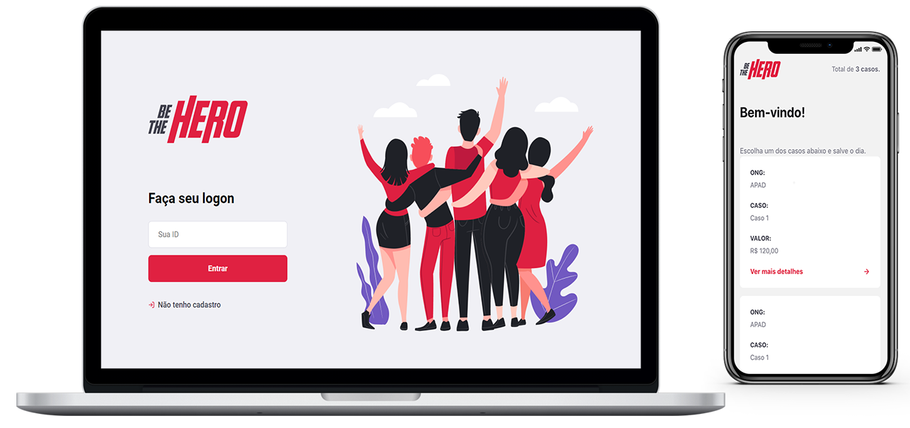

<h1 align="center">
    
</h1>

<h3 align="center">
    Semana OmniStack 11.0
</h3>

  

## Be The Hero
Aplicação multiplataforma, para ajudar instituições/ongs em determinados casos.

### Tecnologias
- [Node.js](https://nodejs.org/en/)
- [React](https://reactjs.org)
- [React Native](https://facebook.github.io/react-native/)
- [Expo](https://expo.io/)
